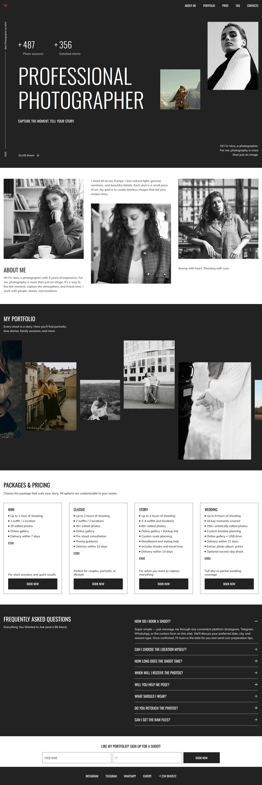
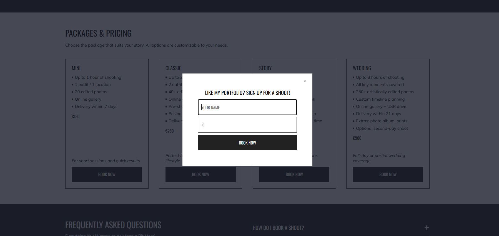

# Photographer Portfolio Website

A responsive portfolio website for a photographer featuring a dynamic image slider, pricing packages, FAQ section, and a booking modal. The project is implemented using Vanilla JavaScript (ES Modules) with a focus on modular architecture and interactive UI components.

---

## Screenshot

### Main Page

<p align="center">
  
</p>

### Booking Modal

<p align="center">
  
</p>

---

🔗 Live Demo: https://tatiana-golub.github.io/photographer-portfolio-website/

---

## ✨ Features

- Responsive layout
- Burger menu for mobile devices
- Custom horizontal portfolio slider with smooth animation
- Booking modal
- FAQ section

---

## Technologies Used

- HTML5 — semantic markup, accessibility attributes, lazy loading
- CSS3 — BEM methodology, CSS variables, Flexbox, Grid
- JavaScript (ES6+) — modular architecture
- Native <dialog> API for modal implementation

---

## Architecture

The project follows modular architecture:

```
root
│
├── index.html
│
├── css
│   ├── base.css
│   ├── components.css
│   ├── layout.css
│   └── responsive.css
│
├── js
│   ├── burger.js
│   ├── main.js
│   ├── modal.js
│   └── slider.js
│
└── assets
    ├── icons
    ├── images
    └── screenshots
```
---

## Installation & Setup

```bash
git clone https://github.com/Tatiana-Golub/photographer-portfolio-website.git
cd photographer-portfolio-website
```
Run the project using Live Server or any local development server.

---

## Key Implementations

- Custom JavaScript slider built without external libraries
- Modal window implemented using the native <dialog> element
- Modular JavaScript architecture with ES modules
- Supports prefers-reduced-motion

---

## Performance Optimizations

- lazy loading for images
- modular JavaScript
- CSS variables
- optimized animation using requestAnimationFrame